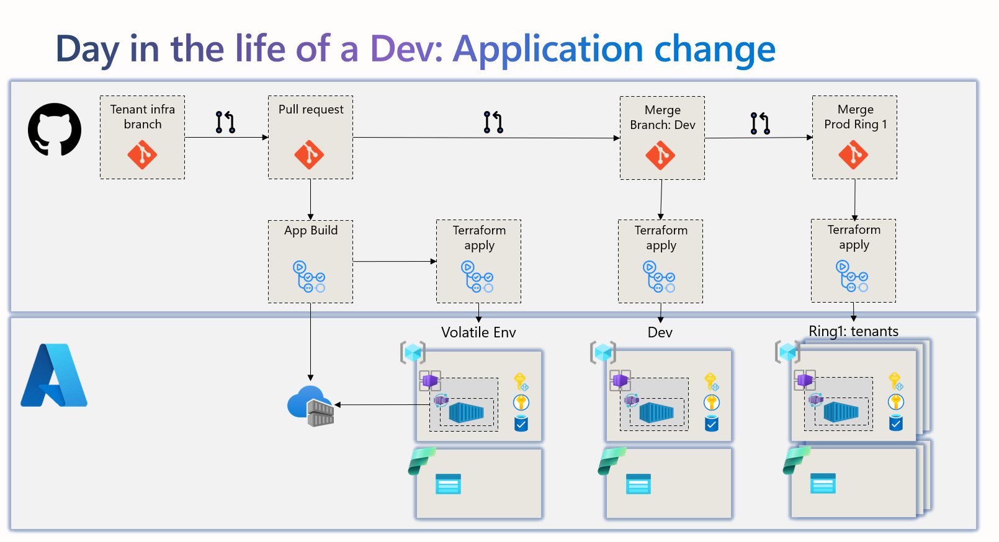

# azure-aca-dev

This repo show some flows on how you can do multi tenancy on Azure




## Setup GitHub actions
```
# You need to be owner to do role assignments
$sp = az ad sp create-for-rbac --name "crgar-aca-dev-sp" --role owner --scopes /subscriptions/14506188-80f8-4dc6-9b28-250051fc4ee4 --sdk-auth

# Create the following GH secrets, you can use `gh secret set`

AZURE_CLIENT_ID = clientId
AZURE_CLIENT_SECRET = clientSecret
AZURE_TENANT_ID = tenantId
AZURE_SUBSCRIPTION_ID = subscriptionId

or 

gh secret set AZURE_CLIENT_ID --repos crgarcia12/azure-aca-dev --body "..."
gh secret set AZURE_CLIENT_SECRET --repos crgarcia12/azure-aca-dev --body "..."
gh secret set AZURE_TENANT_ID --repos crgarcia12/azure-aca-dev --body "..."
gh secret set AZURE_SUBSCRIPTION_ID --repos crgarcia12/azure-aca-dev --body "..."

```